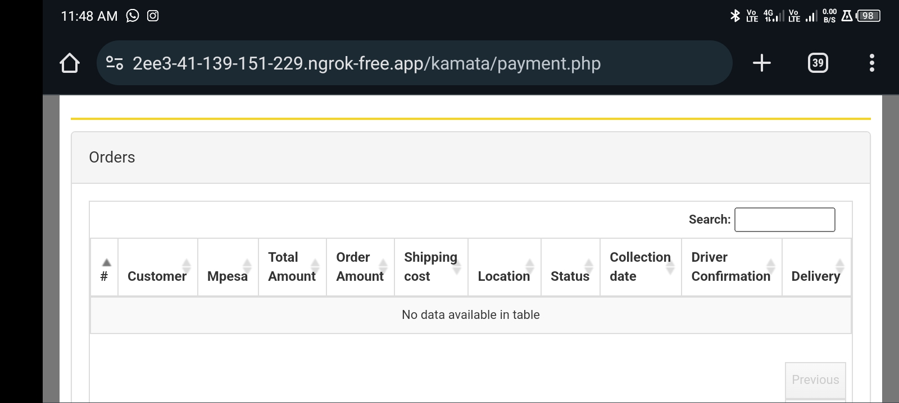
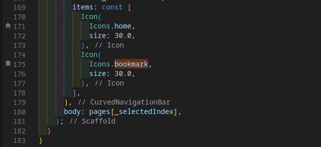
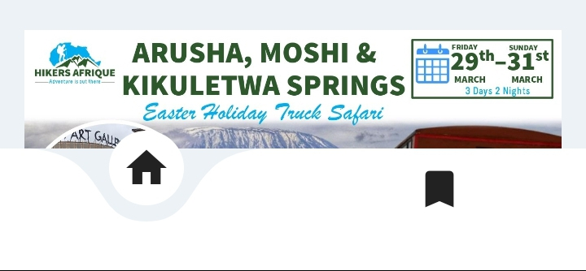

# hikersafrique

An Application for Hiking  

## Getting Started

This project is a starting point for a Flutter application.

A few resources to get you started if this is your first Flutter project:

- [Lab: Write your first Flutter app](https://docs.flutter.dev/get-started/codelab)
- [Cookbook: Useful Flutter samples](https://docs.flutter.dev/cookbook)

For help getting started with Flutter development, view the
[online documentation](https://docs.flutter.dev/), which offers tutorials,
samples, guidance on mobile development, and a full API reference.


**WEBDASHBOARD(web-app)**
Every page should have a search bar to search the necessary data of that page.

```
finance manager(booked_events.dart)
LOGISTICS(logistics.dart)
PARTNERSPAGE(partners.dart)
event manager(manager_events.dar
t)
```
the employee and client section as well should have search bars to search the data in each of the the pages.

like this one, there's a search bar there..
* * *





* * *


**HIKERSAFRIQUE(app)**
the feedback of the client should be directed to either of the users in the system and the user should see the feedback given to them. When a client want to provide feedback there should be a list of the user the feedback should be directed to.
This means the feedback.dart will be edited and every users file, on the drawer will be edited as well to be able to see the feedback given to them,but any method to achieve the desired goal is welcomed.
```
driver.dart
guide.dart
logistics.dart
partners.dart
event_manager_home.dart
finance_manager_home.dart
```

**TICKET SESSION.**
I will request an opinion on how to handle this part.
The client is required is to purchase an event but should not download the event until the finance manager approves the payment.
This means that I have to logoff from the client session on the and go to the finance_manager and approve then come back to download the ticket.
Why Is It Hard.
when a client logins and logout, the session ends, and also the user can not download a ticket right now after login because they will have to repeat the process again.
My suggestion was to create a page for `processed payments`, 








where we can shift the download ticket functionality to that page, where by even after logging out, the processed payments will remain until that session is finished by the user. 
But I still do welcome any suggestions on how we can achieve this concept. 
